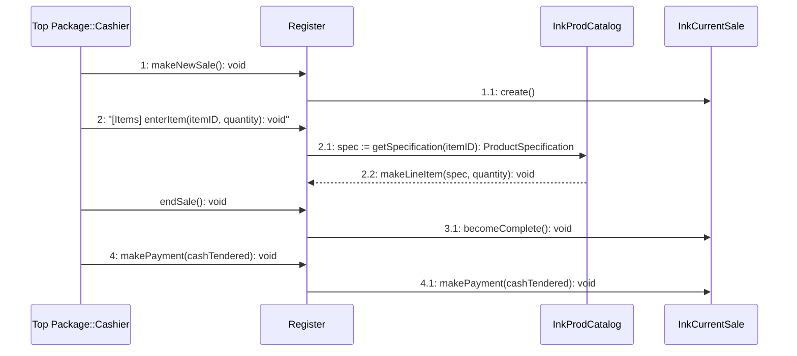

# Lecture: 20260513_impl

**Author:** Prof. Dr. Andreas Wölfl | **Source:** 20260513_impl.pdf

## [Folie 1]
### SOFTWARE ENGINEERING

Prof. Dr. Karsten Becker  
Fakultät Angewandte Informatik  
Technische Hochschule Deggendorf  

[karsten.becker@th-deg.de](mailto:karsten.becker@th-deg.de)

---

## [Folie 2]
### Implementierung

> **[Visual Content]:** A flowchart illustrating the implementation process in software engineering.

```mermaid
flowchart TD
    A[Absichten Aufgaben] -->|red| B[Anforderungsspezifikation (HW/SW)]
    B -->|red| C[Systementwurf (HW/SW)]
    C -->|red| D[SW-Grobentwurf]
    D -->|red| E[SW-Feinentwurf]
    E -->|red| F[SW-Module]
    F -->|red| G[Implementierung]
    G -->|red| H[Integrierte SW-Module]
    H -->|red| I[Integriertes System (HW/SW)]
    I -->|red| J[Installiertes System (Ziel-HW)]
    J -->|red| K[Genutztes System]
    
    B -->|green| J
    C -->|green| I
    D -->|green| H
    E -->|green| F
    H -->|green| I
    I -->|green| K
```

- **Absichten Aufgaben**: Initial intentions and tasks.
- **Anforderungsspezifikation (HW/SW)**: Requirements specification for hardware and software.
- **Systementwurf (HW/SW)**: System design for hardware and software.
- **SW-Grobentwurf**: Software rough design.
- **SW-Feinentwurf**: Software detailed design.
- **SW-Module**: Software modules.
- **Implementierung**: Implementation phase.
- **Integrierte SW-Module**: Integrated software modules.
- **Integriertes System (HW/SW)**: Integrated system (hardware/software).
- **Installiertes System (Ziel-HW)**: Installed system (target hardware).
- **Genutztes System**: Utilized system.

---

## [Folie 3]
### Implementierung

#### Historische Entwicklung

> **[Visual Content]:** A flowchart depicting the historical development of programming languages from 1960 to 2000. The chart includes languages such as Algol, Fortran, PL/1, Cobol, Simula, Pascal, C, Modula2, Ada83, Objective C, C++, Eiffel, Java, Delphi, Ada 95, ObjectPascal, ObjectCobol, Smalltalk (various versions), LISP, Prolog, Loops, CLOS, and C#. The chart shows the evolution and influence between these languages with arrows indicating the direction of influence. There are labels indicating "nicht oo." (not object-oriented) and "objektorient." (object-oriented).

---

## [Folie 4]
### Implementierung

#### Programmiersprachen Generationen

- **1. Generation**
  - „Computer“ kennen nur zwei Zustände
    - Strom an („1“)
    - Strom aus („0“)
  - Programme („Kochrezepte“) waren Abfolgen binärer Befehle, meist über Schalter mechanisch einzustellen z.B.
    ```
    00110101 10101101 00110101
    00110011 10101101 00110101
    10101101 01100110 00110101
    00110101 10101101 00110101
    01100110 10101101 00110101
    10101101 01100110 00110101
    ```

> **[Visual Content]:** The slide includes images of early computing devices, illustrating the mechanical nature of programming in the first generation of programming languages.

---

## [Folie 5]
```markdown
### Implementierung

#### Programmiersprachen Generationen

- **2. Generation**
  - „Benennung solcher „maschinennaher“ Befehle durch "Namen„ (symbolische Notation — Assembler)
  - Benötigt Übersetzung in „Maschinensprache“ (0/1): 1-zu-1 z.B.

```plaintext
mov dx,03c4h
mov ax,0604h
out dx,ax
neq ax,0100h
out dx,ax
lda dx,03c2h
mov al,0e3h
neq dx,al
mov dx,03c4h
add ax,6500
ret
```

> **[Visual Content]:** The slide includes images of a device labeled "SUPERCODER 2000" and a punched card.
```

---

## [Folie 6]
### Implementierung

#### Programmiersprachen Generationen

- **3. Generation**
  - Weitere Abstraktion: „höhere“ Programmiersprachen
  - Befehle intuitiver, „Kochrezept“ näher an der natürlichen Sprache
  - Benötigt kompliziertere Übersetzer
    - 1-zu-5 oder 1-zu-10 Maschinenbefehle
  - Z.B. COBOL, FORTRAN, Pascal, ..., C++, Java
  - ```java
    for (int i=1; i < surveyor.length; i++) {
        if (surveyor[i].rating.equals(excellent)) {
            surveyor[i].salary += 6500;
        }
    }
    ```

---

## [Folie 7]
### Implementierung

#### Programmiersprachen Generationen

- **4. Generation**
  - 1-zu-30 oder 1-zu-50 Maschinenbefehle
  - Z.B. Focus, Natural
    - for every surveyor  
      if rating is excellent  
      add 6500 to salary

---

## [Folie 8]
### Implementierung

#### Unterschiede C vs. C++/Java

- **C ist funktionale Programmiersprache**
  - Gut für Embedded Programmierung
  - Laufzeit- und Speicher-effizient
  - Maschinennah, Treiber-Programmierung

- **C++/Java ist objektorientierte Programmiersprache**
  - Gut für große Anwendungen mit komplexen Strukturen
  - Objektorientierte Modellierung und Programmierung
  - GUI-Programmierung
  - Client/Server-Programmierung
  - Maschinenunabhängige Programmierung (insbesondere Java)

---

## [Folie 9]
### Implementierung

#### Unterschiede C vs. C++/Java

- **Java**
  - Byte-Interpreter absolut maschinenunabhängig
  - Garbage Collector – einfachere Speicherverwaltung für Applikation
  - Nur Einfachvererbung
  - Byte-Interpreter ergibt Performance-Nachteile

- **C++**
  - Eingeschränkte Maschinenunabhängigkeit (z.B. MFC-Bibliothek stark Windows-lastig)
  - Dynamische Speicherallokation und Verwaltung durch Applikation => fehleranfällig
  - Mehrfachvererbung (kann Probleme erzeugen)
  - I.d.R. Laufzeit-optimaler als Java

---

## [Folie 10]
### Implementierung

OOD → Implementierung

- Übergang vom OO-Design zur Implementierung
- Am Ende des objektorientierten Entwurfs existieren u.a.
  - Klassendiagramm
  - Sequenzdiagramm
  - Kommunikationsdiagramm
- Ziel der Implementierung ist, mit Hilfe der ermittelten Diagramme möglichst automatisch lauffähigen Code zu generieren

---

## [Folie 11]
### Implementierung

OOD → Implementierung – Beispiel aus POS-System

- **Point-Of-Sale-System (POS)**
  - System zur Aufzeichnung von Verkaufsvorgängen (inkl. Zahlungen) in einem Geschäft
  - Besteht aus Software- und Hardwarekomponenten (Monitor, Computer, Barcodescanner, usw.)

- **Wichtiges Szenario**
  - Verkauf
  - Haupt-Aktor: Kassierer

- Szenario-Teil dient als Ausgangspunkt für beispielhafte Umsetzung des Entwurfs in Code

---

## [Folie 12]
### Implementierung

**OOD → Implementierung – Beispiel aus POS-System**

- Kunde kommt mit Waren zum Kassierer
  - Kassierer beginnt neuen Verkaufsvorgang.
  - Kassierer gibt Kennung des Artikels ein.  
    System zeichnet den Verkauf des Artikels auf und zeigt Beschreibung, Preis und Gesamtsumme an.  
    Kassierer wiederholt Schritt solange bis alle Waren eingegeben sind.
  - Kassierer beendet den Verkaufsvorgang.  
    System zeigt Gesamtsumme inklusive enthaltener Mehrwertsteuer an.
  - Kunde bezahlt und Kassierer gibt die Bestätigung des Vorgangs ein.  
    System speichert kompletten Verkaufsvorgang.  
    System druckt Beleg aus.  
    Kunde verlässt Kassierer mit gekauften Waren.

---

## [Folie 13]
### Implementierung

#### OOD → Implementierung – Beispiel aus POS-System – Klassendiagramm

> **[Visual Content]:** The slide contains a class diagram illustrating the implementation of a POS (Point of Sale) system. The diagram includes the following classes and their relationships:

- **Register**
  - **Methods:**
    - `makeNewSale() : void`
    - `enterItem(id : long, quantity : int) : void`
    - `endSale() : void`
    - `makePayment(cashTendered : double) : void`
  - **Relationships:**
    - `looks-in` to **ProductCatalog** (1 to 1)
    - `captures` **Sale** (1 to 1)

- **ProductCatalog**
  - **Methods:**
    - `getSpecification(id : long) : ProductSpecification`
  - **Relationships:**
    - `contains` **ProductSpecification** (1 to 1..*)

- **ProductSpecification**
  - **Attributes:**
    - `itemID : long`
    - `price : double`
    - `description : String`
  - **Constructor:**
    - `ProductSpecification(id : long, price : double, descr : String) : void`
  - **Relationships:**
    - `describes` **SalesLineItem** (1 to 0..*)

- **Sale**
  - **Attributes:**
    - `date : Date`
    - `isComplete : boolean`
    - `time : Time`
  - **Methods:**
    - `becomeComplete() : void`
    - `makeLineItem(spec : ProductSpecification, quantity : int) : void`
    - `makePayment(cashTendered : double) : void`
    - `calculateTotal() : double`
  - **Relationships:**
    - `contains` **SalesLineItem** (1 to 1..*)
    - `paid-by` **Payment** (1 to 1)

- **SalesLineItem**
  - **Attributes:**
    - `quantity : int`
  - **Methods:**
    - `calculateSubtotal() : double`

- **Payment**
  - **Attributes:**
    - `amount : double`
  - **Constructor:**
    - `Payment(cashTendered : double) : void`

---

## [Folie 14]
```markdown
### Implementierung

**OOD → Implementierung – Beispiel aus POS-System – grobes Sequenzdiagramm**

> **[Visual Content]:** A sequence diagram illustrating the implementation of a POS system. It includes interactions between the `Cashier`, `Register`, `InkProdCatalog`, and `InkCurrentSale`.


```

---

## [Folie 15]
```markdown
### Implementierung

**OOD → Implementierung – Beispiel aus POS-System – Ausschnitt Kommunikationsdiagramm**

> **[Visual Content]:** A communication diagram illustrating the interaction between different components in a POS system. The diagram includes the following elements:
> 
> - **Actor:** Cashier
>   - Action: `enterItem(id, quantity): void`
>   - Note: "hier nur Schritt 2 des Hauptszenarios"
> 
> - **Register**
>   - Action: `makeLineItem(spec, quantity): void`
> 
> - **InkCurrentSale: Sale**
>   - Action: `2.2.2: <undefined>(saleItem) //add`
> 
> - **InkProductCatalog: ProductCatalog**
>   - Action: `2.1: spec = getSpecification(id): ProductSpecification`
>   - Action: `2.2.1: <undefined>(spec, quantity) //create`
> 
> - **ProductSpecification**
>   - Action: `2.1.1: spec = <undefined>(id) //find: ProductSpecification`
>   - Note: "Dies ist eine Sammlung von Objekten vom Typ ProductSpecification."
> 
> - **saleItem: SalesLineItem**
> 
> - **SalesLineItem**
>   - Note: "Dies ist eine Sammlung von Objekten vom Typ SalesLineItem."

> "Erst bei der Realisierung der beiden Sammlungen in der Implementierungsphase ergeben sich die Operationen aufgrund des gewählten Containers."
```

---

## [Folie 16]
### Implementierung

OOD → Implementierung – allgemeine Vorgehensweise

- Klassendefinitionen auf Basis der Klassendiagramme erzeugen
- Typanpassung einfacher Attribute
- Typanpassung Operationen
- Umsetzung/Anpassung Assoziationen zu Referenzattributen (1:1-Beziehung) bzw. Containern/Collections (1:n-Beziehung)
- Umsetzung Interaktionsdiagramme in Methodendefinitionen
- Fertigstellung Methodendefinitionen (lokale Variablen, Algorithmen)

---

## [Folie 17]
### Implementierung

OOD → Implementierung – Beispiel aus POS-System – Erzeugen Klasse Sale (1)

- Verwendet von Klasse Sale und assoziierten Klassen Payment, SalesLineItem
- Klasse Sale wird auf Basis Klassendiagramm in Zielsprache Java erzeugt (Verwendung eines CASE-Tools kann Erzeugung größtenteils automatisch erfolgen)

> **[Visual Content]:** Klassendiagramm
>
> - **Sale**
>   - `date : Date`
>   - `isComplete : boolean`
>   - `time : Time`
>   - `becomeComplete() : void`
>   - `makeLineItem(spec : ProductSpecification, quantity : int) : void`
>   - `makePayment(cashTendered : double) : void`
>   - `calculateTotal() : double`
>
> - **SalesLineItem**
>   - `quantity : int`
>   - `calculateSubtotal() : double`
>
> - **Payment**
>   - `amount : double`
>   - `Payment(cashTendered : double) : void`

- **Relationships:**
  - `Sale` contains `SalesLineItem` (1 to 1..*)
  - `Sale` paid-by `Payment` (1 to 1)

---

## [Folie 18]
### Implementierung

#### OOD → Implementierung – Beispiel aus POS-System – Erzeugen Klasse Sale (2)

> **[Visual Content]:** Diagram of the `Sale` class with attributes and methods.

| Sale                                |
|-------------------------------------|
| **Attributes:**                     |
| date : Date                         |
| isComplete : boolean                |
| time : Time                         |
| **Methods:**                        |
| becomeComplete() : void             |
| makeLineItem(spec : ProductSpecification, quantity : int) : void |
| makePayment(cashTendered : double) : void |
| calculateTotal() : double           |

```java
public class Sale {
    private Date date;
    private boolean isComplete;
    private Time time;

    public SalesLineItem lnkSalesItem;
    public Payment lnkPayment;

    public void becomeComplete() { }

    public void makeLineItem(ProductSpecification spec, int quantity) { }

    public void makePayment(double cashTendered) { }

    public double calculateTotal() {
        return 0.0;
    }
}
```

> **Note:**  
> Source code was generated with the tool "ArgoUML". Java import statements were removed for clarity.

---

## [Folie 19]
### Implementierung

OOD → Implementierung – Beispiel aus POS-System – Typanpassung einfacher Attribute

- Manuelle Anpassung notwendig, falls Datentypen der Attribute in Zielsprache nicht vorhanden sind
- Im Beispiel: in Java existiert kein Typ „Time“
  - Manuelle Anpassung notwendig: Zeiten können zusammen mit Datum mit Datentyp „Calendar“ verarbeitet werden
  - Andere Attribute entsprechen Java-Datentyp

> **[Visual Content]:** Diagram showing a class `Sale` with attributes:
> - `date : Date`
> - `isComplete : boolean`
> - `time : Time`
>
> Methods include:
> - `becomeComplete() : void`
> - `makeLineItem(spec : ProductSpecification, quantity : int) : void`
> - `makePayment(cashTendered : double) : void`
> - `calculateTotal() : double`

---

## [Folie 20]
### Implementierung

OOD → Implementierung – Beispiel aus POS-System – Typanpassung Operationen

- Manuelle Anpassung notwendig, falls Datentypen der Methoden in Zielsprache nicht vorhanden sind
- Methoden der Klasse Sale verwenden existierende Java-Datentypen bzw. selbst definierte Klassen (ProductSpecification) ⇒ keine manuelle Anpassung notwendig

> **[Visual Content]:** Diagram of the `Sale` class with attributes and methods:
> - **Attributes:**
>   - `date : Date`
>   - `isComplete : boolean`
>   - `time : Time`
> - **Methods:**
>   - `becomeComplete() : void`
>   - `makeLineItem(spec : ProductSpecification, quantity : int) : void`
>   - `makePayment(cashTendered : double) : void`
>   - `calculateTotal() : double`

---

## [Folie 21]
```markdown
### Implementierung

OOD → Implementierung – Beispiel aus POS-System – Umsetzung Assoziationen (1)

- Manuelle Anpassung notwendig, falls Datentypen der Referenz-Attribute (ergeben sich aufgrund der Assoziationen) in Zielsprache nicht vorhanden
- Korrekte Umsetzung von 1:n-Beziehungen durch passende Daten-Container (z.B. Listen, Mengen, Arrays) zu prüfen

> **[Visual Content]:** Diagram showing the relationship between `Sale`, `SalesLineItem`, and `Payment` classes.
>
> - **Sale**
>   - Attributes:
>     - `date : Date`
>     - `isComplete : boolean`
>     - `time : Time`
>   - Methods:
>     - `becomeComplete() : void`
>     - `makeLineItem(spec : ProductSpecification, quantity : int) : void`
>     - `makePayment(cashTendered : double) : void`
>     - `calculateTotal() : double`
>
> - **SalesLineItem**
>   - Attributes:
>     - `quantity : int`
>   - Methods:
>     - `calculateSubtotal() : double`
>
> - **Payment**
>   - Attributes:
>     - `amount : double`
>   - Methods:
>     - `Payment(cashTendered : double) : void`
>
> - Relationships:
>   - `Sale` contains `SalesLineItem` (1 to many)
>   - `Sale` paid-by `Payment` (1 to 1)
```

---

## [Folie 22]
### Implementierung

OOD → Implementierung – Beispiel aus POS-System – Umsetzung Assoziationen (2)

- 1:1-Beziehung zwischen „Sale“ und „Payment“ (Assoziation „Paid-by“)
- Aufgrund der Richtung und der Multiplizität der Assoziation ergibt sich, dass jedes Objekt der Klasse „Sale“ ein Objekt der Klasse „Payment“ referenzieren muss. Dies wird vom UML-Tool ArgoUML durch Erzeugung des Attributes lnkPayment automatisch umgesetzt.

> **[Visual Content]:** 
> 
> - **UML Diagram:**
>   - **Sale**
>     - Attributes: 
>       - `date : Date`
>       - `isComplete : boolean`
>       - `time : Time`
>     - Methods:
>       - `becomeComplete() : void`
>       - `makeLineItem(spec : ProductSpecification, quantity : int) : void`
>       - `makePayment(cashTendered : double) : void`
>       - `calculateTotal() : double`
>   - **SalesLineItem**
>     - Attributes:
>       - `quantity : int`
>     - Methods:
>       - `calculateSubtotal() : double`
>   - **Payment**
>     - Attributes:
>       - `amount : double`
>     - Methods:
>       - `Payment(cashTendered : double) : void`
>   - Associations:
>     - `Sale` contains `SalesLineItem` (1 to many)
>     - `Sale` paid-by `Payment` (1 to 1)

```java
import java.util.Calendar;

public class Sale {
    ...
    private Calendar dateTime = new Calendar();
    private boolean isComplete = false;
    private Payment lnkPayment;
    ...
}
```

---

## [Folie 23]
```markdown
### Implementierung

OOD → Implementierung – Beispiel aus POS-System – Umsetzung Assoziationen (3)

- 1:n-Beziehung zwischen „Sale“ und „SalesLineItem“ (Assoziation „contains“)
- Aufgrund der Richtung und der Multiplizität der Assoziation ergibt sich, dass jedes Objekt der Klasse "Sale" i.A. mehrere Objekte der Klasse "SalesLineItem" referenzieren muss.
  - Umsetzung nicht automatisch, sondern muss manuell durch Festlegung einer Sammlung (hier: ArrayList) erfolgen

> **[Visual Content]:** UML Diagram showing the relationship between `Sale` and `SalesLineItem` classes.
>
> - **Sale**
>   - Attributes:
>     - `date : Date`
>     - `isComplete : boolean`
>     - `time : Time`
>   - Methods:
>     - `becomeComplete() : void`
>     - `makeLineItem(spec : ProductSpecification, quantity : int) : void`
>     - `makePayment(cashTendered : double) : void`
>     - `calculateTotal() : double`
>
> - **SalesLineItem**
>   - Attributes:
>     - `quantity : int`
>   - Methods:
>     - `calculateSubtotal() : double`
>
> - **Payment**
>   - Attributes:
>     - `amount : double`
>   - Methods:
>     - `Payment(cashTendered : double) : void`
>
> - Association:
>   - `Sale` contains `SalesLineItem` (1 to many relationship)
```

---

## [Folie 24]
### Implementierung

#### OOD → Implementierung – Beispiel aus POS-System – Umsetzung Assoziationen (4)

```java
import java.util.Calendar;

public class Sale {
    ...
    private Calendar dateTime
        = new Calendar();
    private boolean isComplete = false;
    ...
    private Payment lnkPayment;
    
    private ArrayList<SalesLineItem> lnkSalesLineItems
        = new ArrayList<SalesLineItem>();
    ...
}
```

> **Anmerkung:**
> Das Tool "ArgoUML" erzeugt hier den Java-Datentyp "Vector", der allerdings nicht "von Haus aus" typenrein ist. Mit der "ArrayList"-Collection wird sichergestellt, dass nur Objekte vom Typ "SalesLineItem" in die Collection aufgenommen werden.

---

## [Folie 25]
```markdown
### Implementierung

OOD → Implementierung – Beispiel aus POS-System – Umsetzung Interaktionsdiagramm (1)

- Aufrufsequenzen werden i.d.R. aus Interaktionsdiagrammen durch passende Methodenaufrufe automatisch in Code umgesetzt
- Für das POS-System erkennt man aus dem Kommunikationsdiagramm, dass Methode "makeLineItem()"
  - Neues Objekt „SalesLineItem“ erzeugt (create)
  - Neues Objekt der Collection (ArrayList) der "SalesLineItem"-Objekte hinzufügt (add).
- Kommunikationsdiagramm legt nicht fest («undefined»), wie Erzeugung erfolgt und welche Art der Collection zu verwenden ist
```

---

## [Folie 26]
### Implementierung

**OOD → Implementierung – Beispiel aus POS-System – Umsetzung Interaktionsdiagramm (2)**

```mermaid
sequenceDiagram
    participant Register
    participant InkCurrentSale : Sale
    participant salesItem : SalesLineItem
    
    Register ->> InkCurrentSale : makeLineItem(spec, quantity) //add
    InkCurrentSale ->> salesItem : <undefined>(saleItem)//add
    salesItem ->> SalesLineItem : create(spec, quantity) //create
```

> **[Visual Content]:** 
> - **SalesLineItem Collection Note:** 
>   - "Dies ist eine Sammlung von Objekten vom Typ SalesLineItem"
> - **SalesLineItem Creation Note:** 
>   - "Für jeden verkauften Artikel muss ein neues Objekt SalesLineItem erzeugt werden (create). Dieses muss der Sammlung von Objekten vom Typ SalesLineItem hinzugefügt werden (add). Die Art der Erzeugung und der Typ der Sammlung sind noch nicht definiert."

---

## [Folie 27]
```markdown
### Implementierung

OOD → Implementierung – Beispiel aus POS-System – Umsetzung Interaktionsdiagramm (3)

- Definition Klasse "Sale"
  - Methode "makeLineItem" erzeugt "SalesLineItem" und fügt neues Objekt der ArrayList "lnkSalesLineItems" hinzu

```java
import java.util.Calendar;

public class Sale {
    ...
    private ArrayList<SalesLineItem> lnkSalesLineItems
        = new ArrayList<SalesLineItem>();
    ...
    public void makeLineItem(ProductSpecification spec, int quantity) {
        SalesLineItem item = new SalesLineItem(spec, quantity);
        lnkSalesLineItems.add(item);
    }
    ...
}
```
```

---

## [Folie 28]
### Implementierung

OOD → Implementierung – Beispiel aus POS-System – Fertigstellung Methodendefinitionen

- Weitere Programmiertätigkeit befasst sich mit Vervollständigung des Programmcodes
- In der Regel sind jetzt noch Methodenrümpfe i.d.R. manuell zu programmieren (Ausnahmen z.B. in Java: new, add)

---

## [Folie 29]
### Implementierung

#### Round-Trip-Engineering

- **Forward Engineering**
  - Fertiges Softwaresystem ist Ergebnis des Entwicklungsprozesses
  - Erzeugung des Programmcodes aus Entwurfsmodellen

- **Reverse Engineering**
  - Vorhandenes Softwaresystem ist Ausgangspunkt der Analyse
  - Erzeugung des Entwurfsmodells aus Programmcode

- **Round-Trip Engineering**
  - Kombination aus Forward Engineering und Reverse Engineering

---

## [Folie 30]
```markdown
### Implementierung

#### Fehleranfällige Konstrukte

- Jede Programmiersprache (z.B. C, C++, Ada, Java) enthält fehleranfällige Konstrukte
- Ein Beispiel zur Programmiersprache C
  - Gemäß ISO-C-Standard (Anhang G) ist Auswertungsreihenfolge von Ausdrücken nicht spezifiziert
  - Folgender Code sollte nicht geschrieben werden
    ```c
    int x = 1;
    int ar[] = {0, 1, 2};
    int y = ar[++x] + x;
    ```
  - Bei Auswertung von links nach rechts hat y den Wert 4
  - Bei Auswertung von rechts nach links hat y den Wert 3
```

---

## [Folie 31]
```markdown
### Implementierung

#### Safe Subsets

- Zur Vermeidung fehleranfälliger Konstrukte, insbesondere für sicherheitskritische Software, werden Regeln definiert, die ursprünglichen Wortschatz einschränken.
- Z.B. in Bezug auf Auswertungsreihenfolge von Ausdrücken
  - „Verwende den Inkrement-Operator immer in einem eigenen separaten Ausdruck.“
  - Mögliche Lösung zum Problembeispiel
  - ...
    ```c
    ++x;
    int y = ar[x] + x;
    ```
  - ...
- Auf diese Weise entstehen sogenannte „Safe Subsets“
- Z.B. MISRA-C für C
```

---

## [Folie 32]
### Implementierung

#### Allgemeine Codierungsregeln

- Verständlichkeit und Lesbarkeit für Betroffenen wichtiger als geringerer Schreibaufwand
  - Gute Kommentierung
  - Problemorientierter Aufbau
  - Angemessene Datenstrukturen
  - Einheitlicher Programmierstil, möglichst unternehmensspezifisch, zum Teil projektspezifisch

- Verständlichkeit wichtiger als Betriebsmittelbedarf (Speicherplatz, Rechenzeit), insbesondere
  - Lesbarkeit vor Zeitersparnis
  - Klarheit vor Genialität (Programmpflege, Nachweisführung)
  - Gilt nur eingeschränkt im Embedded-Bereich

---

## [Folie 33]
### Implementierung

#### Allgemeine Codierungsregeln

- **Problemorientierter Aufbau**
  - Programm soll in
    - Daten- und
    - Ablaufstruktur
  - Problem widerspiegeln
    - Verwendung von Sprachelementen, die Absicht des Programmierers wiedergeben

- **Stil-Einheit in Großprojekt**
  - Einheitlicher Programmierstil
  - Einheitlicher Dokumentationsstil
  - Einheitliches Programmlayout, z.B.
    - Einrückungen logischer Strukturen
    - Zeilenaufteilung: nur eine Anweisung pro Zeile

---

## [Folie 34]
### Implementierung

#### Allgemeine Codierungsregeln – Änderung von Programmbefehlen

- Vermeiden von Tricks, etwa
  - Mehrfachverwendung von Speicherplatz für verschiedene Zwecke
  - Veränderung Schleifenzählerwerte im Schleifenrumpf
  - Änderungen von Befehlen durch das Programm selbst

- Beispiel: Ruby-Programm
  - Bei Ausführung der Methode `greet()` wird diese Methode durch `def self.greet` für eigenes Objekt neu definiert
  - 2 Objekte (hw, hw2) werden erzeugt
  - Die erzeugte Ausgabe lautet
    - Hallo, Welt!
    - Tschüss, Welt!
    - Hallo, Welt!

```ruby
class HelloWorld
  def greet()
    print("Hallo, Welt!\n");
    def self.greet()
      print("Tschüss, Welt!\n")
    end
  end
end

hw = HelloWorld.new
hw2 = HelloWorld.new
hw.greet()
hw.greet()
hw2.greet()
```

---

## [Folie 35]
### Implementierung

#### Allgemeine Codierungsregeln

- **Bezeichner**
  - Eindeutige Identifizierung der Objekte
  - Leicht erkennbare Bedeutung
  - Begriffliche Bedeutung: “So lang wie nötig, so kurz wie möglich!”
    - “konsistente” und “bedeutungsreiche” Variablen-Namen

- **Deklaration und Initialisierung**
  - Alle Variablen möglichst bei Deklaration initialisieren

- **Keine Zahlen direkt im Code verwenden**
  - Stattdessen Konstanten definieren (Programmpflege!)

---

## [Folie 36]
### Implementierung

#### Fehlerursachen und Fehlerkosten – empirische Ergebnisse (Quelle: Liggesmeier)

|                      | Analyse | Entwurf | Codierung | Entwickler-Test | Systemtest | Feld  |
|----------------------|---------|---------|-----------|-----------------|------------|-------|
| **Relative Anzahl der entstandenen Fehler** | 10%    | 40%    | 50%       |                 |            |       |
| **Relative Anzahl der erkannten Fehler**   | 3%     | 5%     | 7%        | 25%            | 50%        | 10%   |
| **Kosten pro Fehlerkorrektur (DM)**        | 500    | 500    | 500       | 2.000          | 6.000      | 25.000 |

---

## [Folie 37]
```markdown
### Implementierung

#### Codierungsregeln – MISRA

- **MISRA C**
  - Safety Coding Standard für die Programmiersprache C

- Übersetzbares, aber nicht verstehbares C Programm wird als "source code obfuscation" bezeichnet

```c
#include <stdio.h>
main(t,_a)char *a;{return!0<t?t<3?main(-79,-13,a+main(-87,1-_
main(-86,0,a+1)+a)):1,t<_?main(t+1,_a):3,main(-94,-27+t,a)&t==2?_<13?
main(2,_+1,"%s %d %d\n"):9:t<0?t<-72?main(_t,
"@n'+,#'/*{}w+/wfdcnr/,{/jr*/d+e}/*{}/*,w{f+/,w/f{}+,/f{l,+,/n{n,+,/++n+,/#\
;#q#n+,/#k#,*,+/r:'.d*'3,}wK w'K'+}e}+;d}f'|\
q#d*+f!/+k#;q#r}eK#W}r}eK}nW|/;#q#n{}f}#w'){}[n|/+]#n}'d}rw' i;# }[n|/n{n#'; r#w' nc[n|/#l,+K {rw' iK;[i[n|]/w#q#n'wk nw' \
k{K[n|]/w%r{}#w#' i;}r}d|#r;}n|w|b/}'d}e}c\
;;n|{]rw'|/}#;#}#nc,#nw|'/d+e}+;#'rdq#w! nr/ ')}+}r|#r{'n' }#\
}'++|#'(!/'}
```

```c
t<50?-*a?putchar31[a]):main(-65,_a+1):main((*a--='|')+_a+1)
:0<t?main(2,2,"%s"):*a=="/"|!main(0,main(-61,*a,
"lek;dc i@bK'q)-lw'%n+r3#l,{):unwloca-0;m ,vpbks,fxntdCeghiry),a+1);1 ) }
```
```

---

## [Folie 38]
### Implementierung

#### Codierungsregeln – MISRA

- Bereich des V-Modells

> **[Visual Content]:** Flowchart depicting the V-Model process for software safety integrity and development lifecycle.
> 
> - **E/E/PES safety requirements specification** leads to **E/E/PES architecture**.
> - **Software safety requirements specification** leads to **Software architecture**.
> - **Software architecture** leads to **Software system design**.
> - **Software system design** leads to **Module design**.
> - **Module design** leads to **Coding**.
> - **Coding** is influenced by **MISRA C**.
> - **Module design** leads to **Module testing**.
> - **Integration testing (module)** follows **Module testing**.
> - **Integration testing (components, subsystems and programmable electronics)** follows **Integration testing (module)**.
> - **Validation testing** follows **Integration testing (components, subsystems and programmable electronics)**.
> - **Validation testing** leads to **Validated software**.
> 
> - **Validation** is a horizontal process across the flowchart.
> - Arrows indicate the flow of output and verification.

**Lit.: IEC 61508-3, Software safety integrity and the development lifecycle**

---

## [Folie 39]
```markdown
### Implementierung

#### Codierungsregeln – MISRA

- **MISRA: Motor Industry Software Reliability Association**
  - Zusammenschluss von Fahrzeug-Herstellern, Zulieferern und Ingenieurs-Beratungs-Firmen in Großbritannien

- **Historie**
  - MISRA-C: 1998[1]: Erstveröffentlichung April 1998, Nuneaton
  - MISRA-C: 2004[2]: veröffentlicht October 2004, Nuneaton
  - MISRA, Development Guidelines for Vehicle Based Software [6], November 1994, Nuneaton
  - ...

- **Siehe**
  - [http://www.misra.org.uk/](http://www.misra.org.uk/)
  - [http://computing.unn.ac.uk/staff/cgam1/teaching/0703/misra%20rules.pdf](http://computing.unn.ac.uk/staff/cgam1/teaching/0703/misra%20rules.pdf)
```

---

## [Folie 40]
### Implementierung

#### Codierungsregeln – MISRA

- **Reduktion einiger Fehlertypen unterstützen**

> **[Visual Content]:** Pie chart titled "Incident Primary Cause by Phase" with the following segments:
> - Specification: 43%
> - Changes after commissioning: 21%
> - Operation & maintenance: 15%
> - Design & implementation: 15%
> - Installation & commissioning: 6%

- Can help to reduce the 15% of defects that are introduced during design and coding
- Embodies accumulated automotive software engineering knowledge and best practice
- A suitable subset of C for use at SIL2 and above, as suggested by the MISRA Guidelines
- Must be used in conjunction with a structured development process
- Use of MISRA C in itself is no guarantee of software quality – nearly two thirds of defects arise from errors in specification or errors made during changes to specification from which MISRA C can offer little protection

> **Source:** S. Montgomery, The Role of MISRA C in Developing Automotive Software, Ricardo UK

---

## [Folie 41]
### Implementierung

**Codierungsregeln – MISRA – Benutzung von C in der Industrie**

- Erhöhte Wichtigkeit der C Programmiersprache (in der Automotive-Industrie)
- Potential für Portierungsfähigkeit auf große Anzahl verschiedener Micro-Prozessoren
- C ermöglicht high-level, low-level, input/output Operationen
- Erhöhte Komplexität von Applikationen zwingt zum Gebrauch einer Hochsprache gegenüber Assembler-Sprachen
- C kann kleineren und weniger Speicherplatz verbrauchenden Code erzeugen als viele andere Hochsprachen (C++, Java)
- Vermehrter Gebrauch von Code-Generatoren aus Modellierungs-Tools

---

## [Folie 42]
### Implementierung

**Codierungsregeln – MISRA – Unsicherheiten in C**

- Programmierer macht Fehler
  - In Bezug auf Stil und Ausdruck
  - C-Syntax (Tippfehler wie "=" anstatt "==")
  - Philosophie von C ist, dass Programmierer weiß, was er tut (keine PASCAL-ähnliche Typsicherheit)

- Programmierer missversteht die Programmiersprache (z.B. Operator-Präzedenz)

- Compiler macht nicht das, was Programmierer erwartet

- Compiler hat Fehler

- Laufzeit-Fehler: C macht keine Laufzeit-Checks für z.B. Overflows, gültige Address-Zeiger, Array-Out-of-bounds, ...

---

## [Folie 43]
### Implementierung

#### Codierungsregeln – MISRA – Kategorisierung der Regeln

| Regel | Kategorie                      | Regel | Kategorie                     |
|-------|--------------------------------|-------|-------------------------------|
| 1     | Umgebung                       | 12    | Ausdrücke                     |
| 2     | Spracherweiterungen            | 13    | Kontrollfluß-Anweisungen      |
| 3     | Dokumentation                  | 14    | Kontrollfluss                 |
| 4     | Zeichensatz                    | 15    | Switch-Ausdrücke              |
| 5     | Identifiers                    | 16    | Funktionen                    |
| 6     | Datentypen                     | 17    | Zeiger und Arrays             |
| 7     | Konstanten                     | 18    | Strukturen und Unions         |
| 8     | Deklarationen und Definitionen | 19    | Präprozessor-Anweisungen      |
| 9     | Initialisierungen              | 20    | Standard-Bibliotheken         |
| 10    | Arithmetische Typumwandlungen  | 21    | Laufzeit-Fehler               |
| 11    | Zweiertyp-Umwandlungen         |       |                               |

---

## [Folie 44]
```markdown
### Implementierung

Codierungsregeln – MISRA – Beispiele für Regeln

- **Regel 1.4 (Forderung)**
  - Compiler/Linker muss garantieren, dass 31-Zeichen-Unterscheidung sowie Groß-/Kleinschreibung bei externen Identifiers unterstützt werden

- **Regel 1.5 (Ratschlag)**
  - Gleitkomma-Implementierungen sollten sich nach Gleitkomma-Standard richten
  - Z.B.
    ```c
    /* IEEE 754 single-precision floating point */
    typedef float float_32t
    ```
```

---

## [Folie 45]
### Implementierung

**Codierungsregeln – MISRA – Beispiele für Regeln**

- **Regel 2.1 (Forderung)**
  - Assembler-Aufrufe sollen eingekapselt und isoliert sein.
  - Beispiel:
    ```c
    #define NOP asm(" NOP")
    ```

- **Regel 2.2 (Forderung)**
  - Sourcecode soll ausschließlich Kommentare der Form `/* ... */` benutzen

- **Regel 2.3 (Forderung)**
  - Die Zeichenfolge `/*` soll nicht in einem Kommentar benutzt werden

---

## [Folie 46]
### Implementierung

**Codierungsregeln – MISRA – Beispiele für Regeln**

- **Regel 12.1 (Ratschlag)**
  - Möglichst wenig von C-Regeln für Operator-Präzedenzzen abhängig machen

- **Regel 12.2 (Forderung)**
  - Resultat eines Ausdrucks immer gleich: bei jeder mögl. Reihenfolge der Abarbeitung

- **Regel 12.3 (Forderung)**
  - `sizeof`-Operator nicht in Ausdrücken benutzen, die Seiteneffekte beinhalten
  - Beispiel
    ```c
    int32_t i; int32_t j;
    j = sizeof (i=1234);
    /* j is set to the sizeof the type of i which is an int */
    /* i is not set to 1234. */
    ```

---

## [Folie 47]
### Implementierung

**Codierungsregeln – MISRA – Beispiele für Regeln**

- **Regel 12.4 (Forderung)**
  - Rechte Operand eines logischen `&&` oder `||` Operators soll keine Seiteneffekte beinhalten

- **Regel 12.6 (Forderung)**
  - Operanden von logischen Ausdrücken (`&&`, `||` und `!`) sollen Bool'sche Ausdrücke sein. Bool'sche Ausdrücke sollten nirgends sonst als Operanden benutzt werden

- **Regel 12.7 (Forderung)**
  - Bit-Operationen sollen nicht auf Operanden angewenden, deren Datentyp vorzeichenbehaftet ist

---

## [Folie 48]
### Implementierung

#### Codierungsregeln – MISRA – Tools

- **PCLint**
  - PC-Lint überprüft C/C++ Quellcode. Im Gegensatz zu einem Compiler analysiert PC-Lint C/C++ Quellen modulübergreifend.
  - PC-Lint für C/C++ kontrolliert Einhaltung der MISRA Richtlinien.
  - PC-Lint überprüft Quellcode auf typische C++- und C-Fehler und findet:
    - Nicht initialisierte Variablen
    - Vererbte, nicht virtuelle Destruktoren
    - Typ-Unverträglichkeiten
    - Falsch formulierte Makros
    - Unbeabsichtigtes Name-hiding
    - Statische Variablen in In-line-Funktionen von Headern
    - Fehler beim Kopieren einer Basisklasse oder bei der Benutzung des Copyconstructors der Basisklasse
    - Gebrauch von 'throw' in einem Destruktor
    - Unreferenzierte 'catch'-Parameter
    - Virtuelle Funktionen mit einem default Parameter
    - ...

---

## [Folie 49]
### Implementierung

#### Codierungsregeln – MISRA – Tools

- **QA-C/MISRA**
  - Lokalisiert Quellcode, der nicht MISRA-Regeln entspricht
  - Verbindet Meldungen direkt mit Quellcode und entsprechenden MISRA-Regeln
  - Individuell auf jedes MISRA Subset konfigurierbar (auch nur für Teile eines Projektes)
  - Querverweise (HTML) zu Regeldefinitionen und erklärenden Beispielen
  - Reports über die Softwarequalität (Art und Häufigkeit von Regelverletzungen etc.)
  - Erzeugt textliche und grafische Metriken (Testbarkeit, Pflegbarkeit, Portabilität)
  - Unterstützt Qualitätsinitiativen wie CMM, ISO9003/EN29003, ISO 9126, IEC 61508, IEC 26262, DO-178B, Def Stan 00-55
  - Integrationen zu Entwicklungsumgebungen wie z.B. Visual Studio oder Codewright und allen gängigen Versionskontrollsystemen

---

## [Folie 50]
### Implementierung

**Codierungsregeln – MISRA – Zusammenfassung**

- MISRA-C definiert sichere Untermenge von C, aber
  - Wie erreicht man mehr Sicherheit ("Safety") in technischen System, das aus Software, Hardware und Mechanik besteht?
  - Wie soll man mit MISRA ein bestimmtes Integrity Level ("IL") erreichen?
  - Wie soll man mit MISRA ein bestimmtes Safety Integrity Level ("SIL") erreichen?

- Folgende Standards sollen helfen
  - IEC 61508 (Definition der Safety Integrity Levels)
  - IEC 26262 (Anpassung der 61508 an Automotive Erfordernisse)
  - MISRA, Development Guideline for Vehicle Based Software

---

## [Folie 51]
### Implementierung

#### Code Metriken

- Warum wird etwas gemessen?
- Was kann man mit Messwerten anfangen?
- Auf Software bezogen
  - Was kann man an Software messen?
  - Was kann man am Code (z.B. C-Code, C++-Code) messen?
  - Wozu dienen diese Messwerte?
- Ziele
  - Messen von Kenngrößen des Source Codes
  - Rückschlüsse ziehen auf bestimmte Eigenschaften des Codes, z.B.
    - Komplexität
    - Lesbarkeit
    - Testbarkeit

---

## [Folie 52]
### Implementierung

#### Code Metriken

- **Lines of Code**
  - Brutto = mit Kommentarzeilen
  - Netto = ohne Kommentarzeilen
  - Relativ einfach zu messen
  - Ignoriert Komplexität der Anweisungen und Strukturen
  - Abhängig vom persönlichen Stil
  - Begrenzte Aussagekraft

---

## [Folie 53]
### Implementierung

#### Code Metriken

- **Halstead (1977)**
  - Vokabular des Programms $\mu = \mu_1 + \mu_2$ mit
    - $\mu_1 =$ Anzahl unterschiedlicher Operatoren (if, while, +, -, *, ...)
    - $\mu_2 =$ Anzahl unterschiedlicher Operanden (Variable, Konstante, Funktionen, ...)
  - Volumen (Umfang) des Programms $V = N \cdot \log_2 \mu$ mit
  - Länge des Programms $N = N1 + N2$ mit
    - $N1 =$ Gesamtzahl verwendeter Operatoren
    - $N2 =$ Gesamtzahl verwendeter Operanden

---

## [Folie 54]
```markdown
### Implementierung

#### Code Metriken

- **Halstead (1977)**
  - $D = (\mu_1 / 2) \times (N2 / \mu_2)$ Schwierigkeit (Difficulty) ein Programm zu verstehen
  - $E = D \times V$ Aufwand (Effort) das Programm zu verstehen

- **Bewertung**
  - Einfach zu berechnen
  - Komplexe Ausdrücke und viele Variablen berücksichtigt
  - Für alle Programmiersprachen anwendbar
  - Ablaufstrukturen nicht berücksichtigt
  - Namensräume, Sichtbarkeit nicht berücksichtigt
```

---

## [Folie 55]
### Implementierung

#### Code Metriken

- **Mc Cabe (1976)**
  - Basiert auf Kontrollflussgraph G
  - Berücksichtigt Komplexität
  - $V(G) = e - n + 2$ mit
    - $e =$ Anzahl der Kanten von G
    - $n =$ Anzahl der Knoten von G
  - Hier $V(G) = 2$

> **[Visual Content]:** A flowchart illustrating a factorial calculation process:
> - Start with "Fac"
> - Set `erg = 1`
> - While loop condition `while (x > 1)`
>   - Calculate `erg = erg * x`
>   - Decrement `x = x - 1`
> - Return `return(erg)`

---

## [Folie 56]
### Implementierung

#### Code Metriken

- **Mc Cabe (1976)**
  - Bewertung
    - ✅ Einfach zu berechnen
    - ✅ Gibt Indikation für White Box Testaufwand (C1 Überdeckung)
    - ❌ Komplexität der Anweisungen bleibt unberücksichtigt
    - ❌ Schlecht geeignet für Objektorientierte Programmierung
      - ❌ Kurze Methoden
      - ❌ Komplexität liegt im Zusammenspiel von Klassen bzw. Objekten

---

## [Folie 57]
### Implementierung

#### Code Metriken

- **Objekt – orientierte Metriken (Beispiele)**
  - **DIT (Depth of Inheritance Tree)** — Anzahl Oberklassen einer Klasse
  - **NOC (Number of Children of a Class)** — Anzahl direkter Unterklassen
  - **RFC (Response For a Class)** — Anzahl der Methoden, die potentiell ausgeführt werden können, wenn Objekt der betrachteten Klasse auf eingegangene Nachricht reagiert
  - **WMC (Weighed Methods per Class)** — Anzahl definierter Methoden
  - **CRO (Coupling Between Object Classes)** — Anzahl Klassen, auf deren Dienste Klasse zugreift

---

## [Folie 58]
### Implementierung

Zum Abschluss dieser Vorlesung ...

**Noch Fragen ??**
